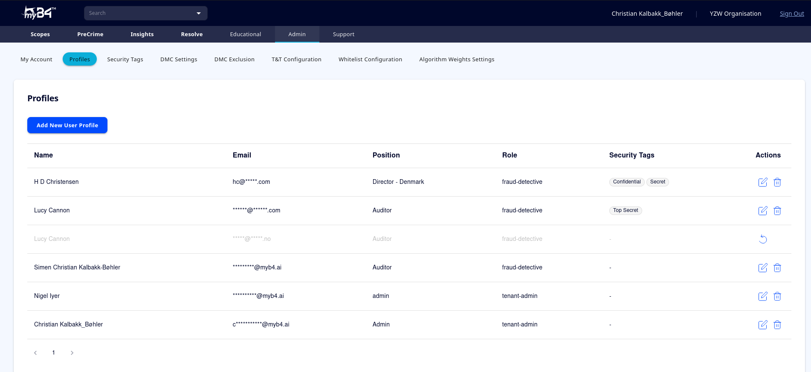
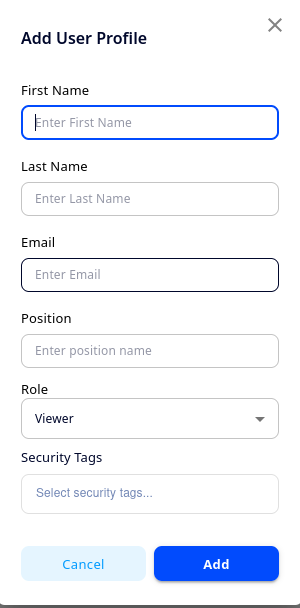
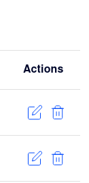
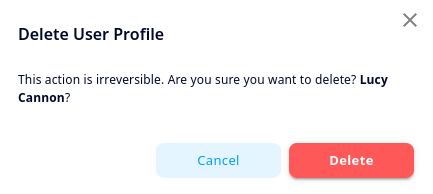
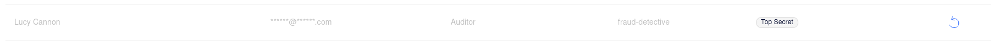

<div style = "index-hero">

# Creating & Deleting Users

As tenant admin, you are able to create and delete users from the Admin suite. 

```admonish info "Creating new admins"
Note that you can only create users with the Viewer or Fraud Detective roles. If you want to have a new Admin user created, or if you want to promote an existing user to Admin, please contact your B4 Team member. 
```

## Creating New Users
To create a new user, first navigate to 'Admin'>'Profiles'. You should see an overview of all the users on your tenant, similar to the one below:

<p align="center">
        
    </p>
    
To create a new user, click the large, blue button reading 'Add New User Profile'. This will open the below window.
<p align="center">
        
    </p>
    
Fill in the various fields, and make sure the correct email has been input. Under 'Position', you can add a descriptive name for the role of the new user. Under 'Role' you can open a drop down menu to assign either Viewer or Fraud Detective as the user role. You can read more about these roles in [**'Chapter 4.1: Roles & Permissions'**](./roles.md). 

Under 'Security Tags', you can assign the appropriate security tags for the user. Simply click the field, and you will open a menu containing all the security tags you have defined. For more information about creating and using security tags, see: [**'Chapter 4.3: Security Tags'**](./security.md).

Finally, click 'Add' to finish creating the user. You should receive a green confirmation message to say the user has been created, and the new user should receive an email with instructions to set up their user. You may direct them to: [**'Chapter 2.2: Access & Accounts'**](../getting-started/access.md).

## Edit Existing Users
To edit a user, click the edit icon under actions next to the user you want to edit:

<p align="center">
        
    </p>
    
This will open the below window, where you can change the 'Position' of the user, change their role between Viewer and Fraud Detective, and add or remove security tags to the user. When you have finished, simply click save, and the user will update. 
<p align="center">
        
    </p>
    
## Remove Users
Finally, from the profiles page, you can also remove users entirely. To do so, click the garbage can symbol under actions next to the user you want to remove:
<p align="center">
        
    </p>
Doing so will open a dialogue box asking you to confirm the deletion of the user. Click the red 'Delete'-button to confirm user removal. 
<p align="center">
        
    </p>

```admonish warning "User Deletion"
When a user has been deleted, they will be entirely unable to log in to myB4.ai. Deleted users cannot directly request restoration, but admin users may restore them from the profile pages (see below).
```

### Restoring Deleted Users
While the dialogue box asserts that a deleted user *cannot* be restored, this is not entirely true. Admin users can still see deleted users, albeit greyed out. 

<p align="center">
        
    </p>
    
To restore the user, click the 'Restore'-symbol under actions, and wait for the confirmation message that the user has been restored. 

```admonish warning "Limit on Restoration"
Users that have been deleted can be recovered while greyed out as described above. However, the user is only guaranteed to be stored in this manner for 21 days after being deleted. If the standby period has expired for a user you want to restore, and you can no longer see them under profiles, you will need to recreate the user as desctibed above.
```
