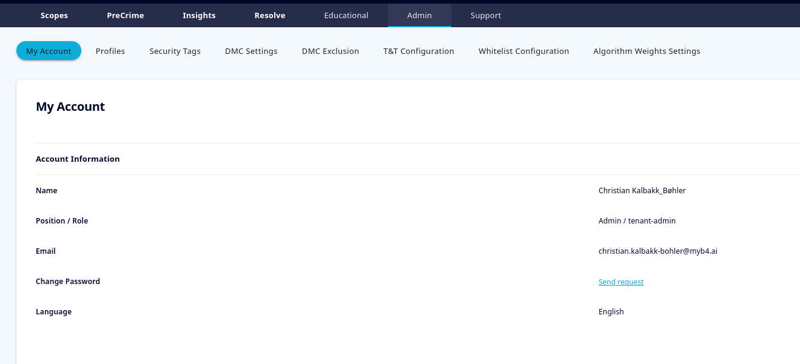

<div style = "index-hero">

# Roles & Permissions

On the user side, there are as of v1.6.x three user levels. They are in ascending order of permissions: Viewer > Fraud Detective > Tenant Admin.
To check your user type, use the taskbar to navigate to 'Admin', then 'My Account'. Here, you will see information about your account, and under Position / Role, you will see first your descriptive position, followed by your user role. 
<p align="center">
        
    </p>

```admonish info "Additional Pages"
Note that the example screenshot above is taken from an admin user. If you are not an admin, you will only see the 'My Account' page. 
```

You may also request a password change from this page. Clicking the link will send an email to your registered email address with instructions on how to update your password. 

## User Roles
Below, the three different tiers of user roles are described in detail.

### Viewer
The Viewer role has the lowest degree of permissions. They may:

- See the scopes they have access to from the Scope Dashboard
- Open those scopes to view the radar and any comments made in it
- Open the Insights page for the scopes they have access to

However, they are not able to create new scopes themselves, nor to alter, delete, upload or comment on existing scopes. The viewer role is best suited for users who are not directly interacting with myB4<sup>TM</sup> on a regular basis, but who may want to view team progress on occasion. 

### Fraud Detective
The Fraud Detective is the most typical user role. In addition to the permissions of the Viewer, they may:

- Create new scopes
- Create column assignment presets
- Edit and Delete *their own* scopes
- Upload and execute data to scopes they have access to
- Make radar comments in the scopes they have access to 

```admonish info "Access to Scopes"
Note that the Fraud Detective is *always* given access to scopes they have created themselves, regardless of security tags. However, other scopes created with tags they are not privy to will not appear in the Scope Dashboard.
```

Fraud Detective users are however not able to Edit or Delete scopes they have not themselves created.

We recommend that most users are assigned with the Fraud Detective role, as this gives comprehensive access to interacting with any scopes that fall under their domain. 

### The Admins
The Tenant Admin has the most extensive user permissions. Beyond the other two user roles, it can: 

- Edit and Delete *any* scope
- View *any* scope, regardless of security tags
- Create and Delete users
- Manage security tags on scopes and users
- Manage Viewer and Fraud Detective roles
- Create new presets for algorithm weights
- Add / Remove countries/entities from the DMC lists and DMC exceptions.
- Add to the Track & Trace function
- Add to the Whitelist

As the admin role has quite far-reaching permissions, it is recommended that as few users as possible are given these extensive permissions. 
