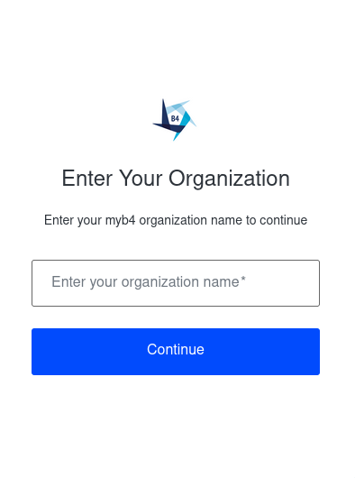
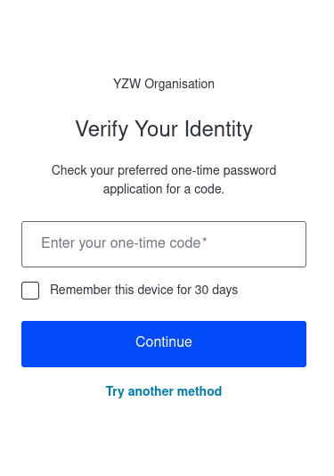
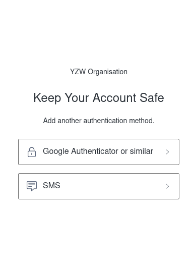
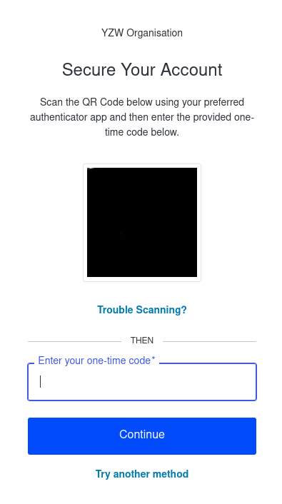
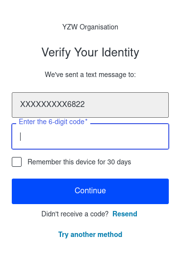
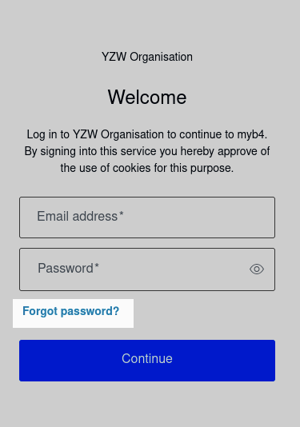
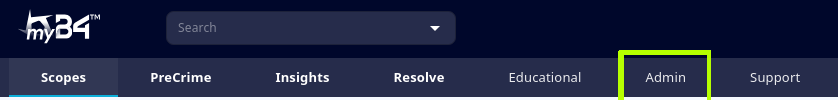
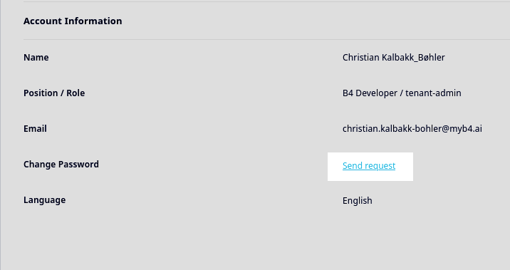

<div style = "index-hero">

# Access & Accounts

This section will explain how to set up a user for the very first time, how to log in to the platform, the various 2-factor authentication options, and changing your password.

## Setting Up Your User

First, your user should be created by an administrator (either your organisation's system administrator, or your B4 technician). After they have created your user, you should receive an email saying your user has been created, and to follow the included link to set up your password. 
Click the link, and follow the instructions to finalise password creation. 

```admonish info "No email received"
We have on occassion experienced users not receiving the automatic email due to firewall restrictions or similar. If this has happened to you, please follow the below instructions [Changing Your Password](./access.md#changing-your-password) to reset your password instead. 
```

## Logging in to myB4.ai

1. Go to [myB4.ai](https://www.myb4.ai), and click 'Sign In'

1. In the below screen, input your organisation name. Normally it will be in all lower case (e.g. 'yzw_international', but if you are unsure, check with you administrator.
    <p align="center">
        
    </p>

1. Next, input your email address and password, and press continue.
    
1. Here, you will be asked to input your 6-digit one-time code, which is sent either to your preferred authenticator app, or by SMS. (see ['2-Factor Authentication'](./access.md#2-factor-authentication) below for more information). 
    <p align="center">
        
    </p>
    
```admonish tip "Alternative Verification"
If you do not have your authenticator app readily available, or if there is an outage causing disruptions to authenticators, or sms-verification, you can verify yourself by clicking **'Try another method'** and selecting email, which will send a one-time code to your user email address. 
```

**You should now be logged in to myB4.ai, please explore the next chapters for more information**

## 2-Factor Authentication

During your first log in, you will be asked to select a method for 2-factor authentication. We recommend using a 2-FA application (e.g. Google Authenticator, Microsoft Authenticator), but SMS verification is also possible. 
<p align="center">
    
</p>

### 2-FA Application

During the set-up for a 2-FA application, you will get a screen like the one below. Open your 2-FA application, and select 'scan a QR code', then scan the QR code. 
<p align="center">
    
</p>

After the initial set up, the next time you log in, you will simply be prompted to input the 6-digit code from your 2-FA application when you log in. 

```admonish info "2-FA Apps with QR-scan"
The following applications can be used for verification. We recommend you check with your administrator if your organisation has any restrictions on the use of authenticators. 
- Google Authenticator
- Microsoft Authenticator
- Proton Authenticator
```

### SMS Verification

As an alternative to 2-FA Applications, you may also use SMS-verification. When you first select this option, you will be asked to input your phone number. You will then be prompted to input the 6-digit code sent to your chosen number.
<p align="center">
    
</p>

## Changing Your Password

If you forget your password, have an issue receiving the initial set-up email, or as part of regular password changes, you may need to reset your password. There are two ways to do this, one is from the log in screen, and one from the platform interface. 

### From Log In 

1. Enter your **Organisation Name** as per normal

1. From the next screen, click **'Forgot Password?'**
    <p align="center">
        
    </p>

1. Next, input your email address, and press 'Continue'. You will receive a link to reset your password within a minute or two.

### From the Platform

1. You can also request changing your password from the platform (You can read more about navigating the platform in chapters 3 and 4). To do so, log in as normal, then go to **Admin**. 
    <p align="center">
        
    </p>

1. From the **Admin** tab, you should see an overview of your profile information, and a 'Send request'-button to change password. Click it, then follow the instructions sent to you by email. 
    <p align="center">
        
    </p>
