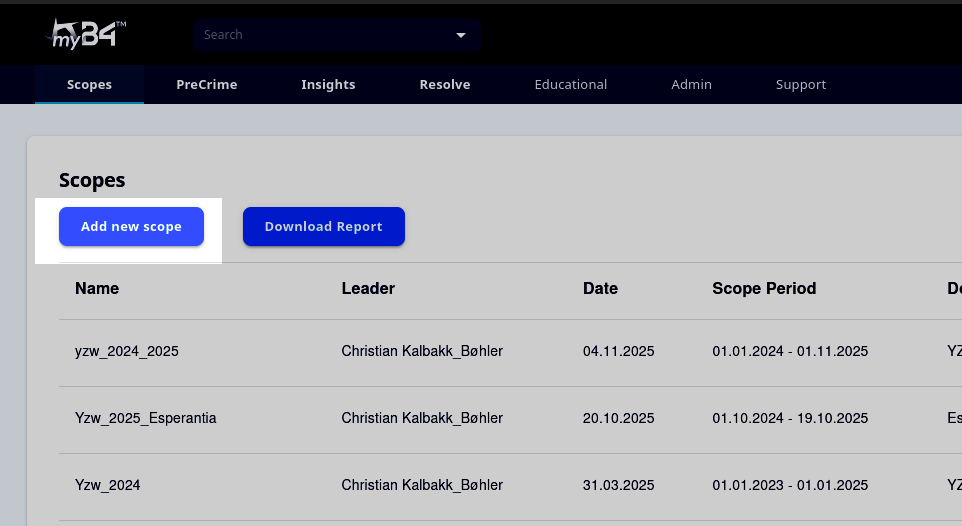
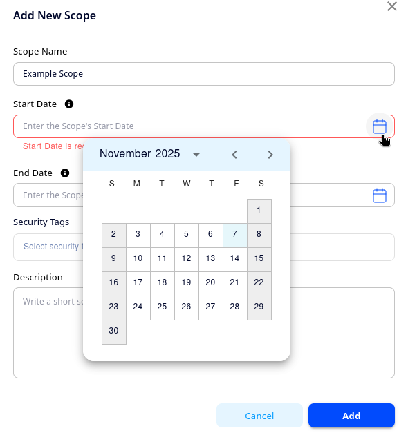
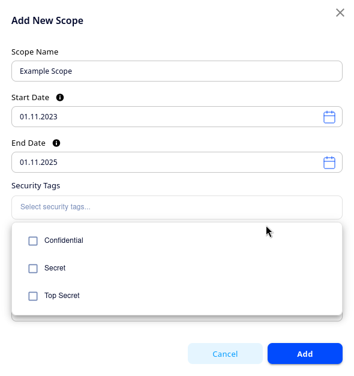
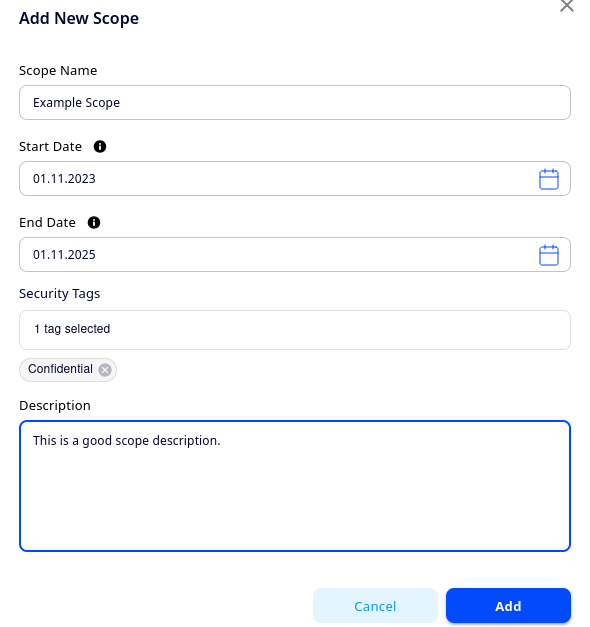

<div style = "index-hero">

# Creating a Scope

Let's take a first dip into myB4.ai by setting up a new scope!

**1. Click 'Add new scope'**
    <p align="center">
        
    </p>
    
**2. Give the scope a descriptive name**
    <p align="center">
        
    </p>
    
**3. Set the scope's start and end date**

This can be done by choosing from the menu that appears when clicking the calendar icon:
    <p align="center">
        
    </p>
Use the drop down to choose the year, and the arrows to choose the month. 

**4. Add security tags**

If you click the field, you will see the security tags that have been configured for your tenant. You can read more about Security Tags in [**Chapter 4.3: Security Tags**](../admin/security.md)
    <p align="center">
        
    </p>
```admonish tip "No security tags"
If you leave all the security tags unselected, the scope will be accessible to all users on the tenant regardless of their access keys.
```

**5. Add a description** 

Finally, add a description. Typically, you will want to include at least information about what unit and time frame the scope covers, and any additional information (if certain groups have been filtered out of the data for instance). 
    <p align="center">
        
    </p>

Then click add, and you should see the scope show up in the scope dashboard. Well done! You are now ready to tackle your first upload. The next [**chapter**](./data-req.md) will explain what sort of data you need from your ERP-system to be able to upload and create a radar. If you are already comfortable with that, feel free to skip ahead to [**Chapter 3.4: Upload & Execute**](./upload.md). 
