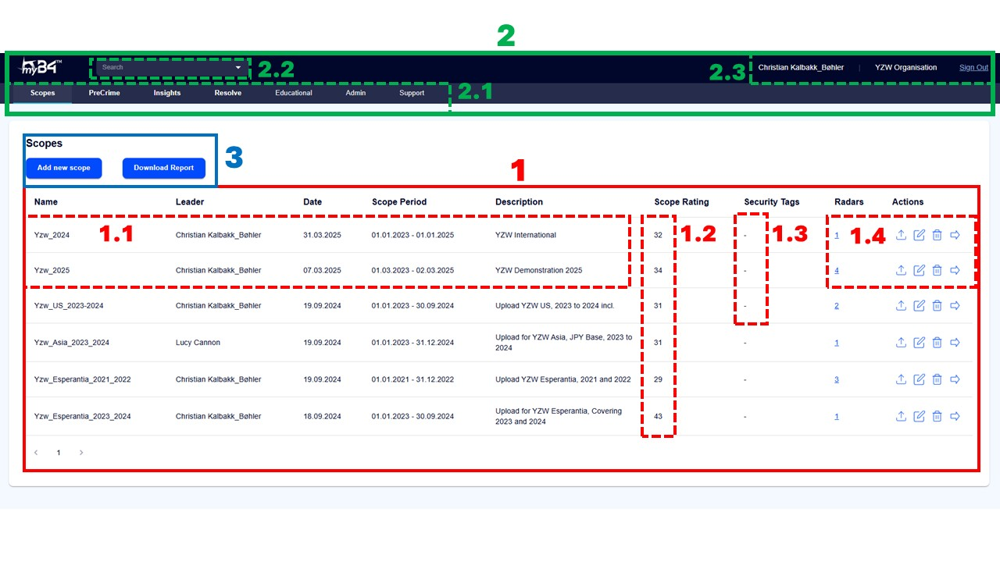
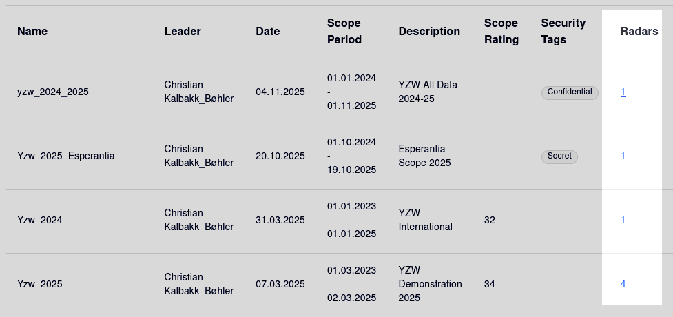
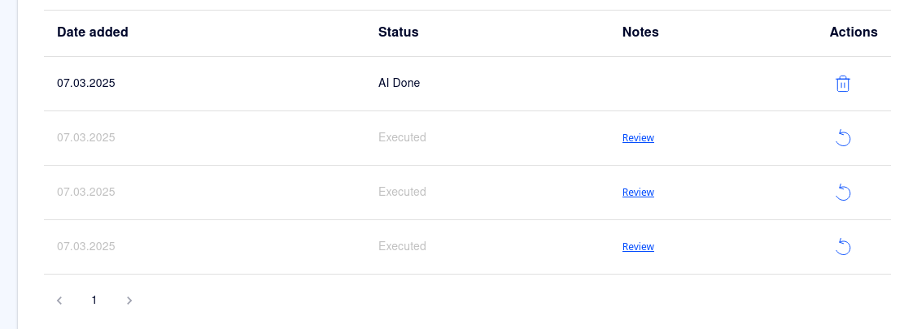

<div class="index-hero">

# Scope Dashboard

Whenever you log into myB4.ai, you should first see the **Scope Dashboard**. This page contains a summary of all the scopes that have been uploaded on your tenant. In this chapter, we will cover the contents of the Dashboard, as well as the toolbar, so you know where everything is when we begin with Scope creation, upload and analysis later on. 

Let's have a look at the Dashboard:
    <p align="center">
        
    </p>
    
## Section 1: The Scope Dashboard

The Scope Dashboard contains an overview of the scopes that have been uploaded to your tenant. It shows some descriptive statistics, security tags, radar history, and actions. Let's look at each of them. 

**1.1 Description:** These columns contain information about the scope in question: its name (usually the business unit and time period in question), the scope leader, the date at which the scope was created, the scope period, and a short description of the contents of the scope.

**1.2 Scope Rating:** The scope rating is an overall rating of the riskiness of the counterparties in a scope. It is calculated as a weighted average of all Risk Indices in that scope, with more weight assigned to the highest ranked counterparties.

**1.3 Security Tags:** This column shows the security tags allocated to a given scope. You can read more about security tags in [**Chapter 4.3 Security Tags**](../admin/security.md).

**1.4 Radars & Actions:** Here, you have access to the radar history, where you can [Roll Back to a Previous Radar](./dashboard.md#roll-back-radar), and the **Actions:**
- **Upload:** Takes you to the upload page (see: [**Chapter 3.4 Upload & Execute](./upload.md))
- **Edit Scope:** Change scope name, description, period and/or security tags.
- **Delete Scope:** Deletes the scope. Scope is recoverable for 21 days, after which it will be **permanently deleted**.
- **Go to Radar:** Takes you to the radar for that scope.

```admonish info "Unavailable Actions"
If you are not the scope leader (or an admin), some of the actions will be greyed out and unavailable. You cannot roll back the radar, change description/security, or delete the scope.
```

## Section 2: The Toolbar
The toolbar is your primary way of navigating myB4.ai. Its contents are: 

**2.1 Tools:** Allows you to navigate to different parts of the platform:
- **Scopes** takes you to the [Scope Dashboard](./dashboard.md)
- **PreCrime** takes you to the [Radar Upload](./upload.md) and [View Radar](./radar.md) pages
- **Insights** takes you to the [myB4 Insights](./insights.md) page.
- **Resolve** takes you to the resolution guidance page (as of v1.6, this is just a placeholder page).
- **Educational** takes you to our educational tools: *Think Like a Thief*, *N-Lighten*, and *the Fraud Detective Challenge*.
- **Admin** takes you to your user profile - and if you have admin privilege, the configuration and admin pages. (See: [**Chapter 4: Admin & Configuration**](../admin/index.md) for more information.
- **Support** takes you to the support pages, where you can see contact information to our helpdesk. 

**2.2 Active Scope**
From this drop-down menu, you can see which scope is currently active, and select which scope is active. You can also create a new scope directly from this drop down menu. 

**2.3 Information & Sign Out** 
Here you can see which user you are logged in as, to which Tenant, and you can sign out safely from your user.

## Section 3: Add Scope and Download Report
Lastly, these two buttons allow you to download a .csv file of the current scope dashboard, and to add a new scope. In the next chapter, [**Creating a Scope**](./create-scope.md), we will look at scope creation in detail. 


## Roll Back Radar
To roll the radar back to a previous version, click the blue number under the column 'Radars' corresponding to the scope you want to roll back:
    <p align="center">
        
    </p>
```admonish tip "The Number of Radars"
The Number itself signifies how many versions of the radar have been uploaded on that scope. In other words, if the number is 1, you have nothing to roll back to, whilst if the number is higher, there are previous versions of the radar you can recover. 
```

After you have clicked the number, you should get to a screen like the one below. Now, simply click the blue, curving arrow to restore the version of the radar you want. 
    <p align="center">
        
    </p>
    
```admonish warning "Check Active Scope"
We recommend that you check which scope is active in the drop down menu (2.2 in the overview image), or under Radar Details, before you roll back to make sure you are on the correct scope. 
```
