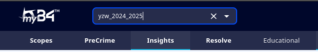
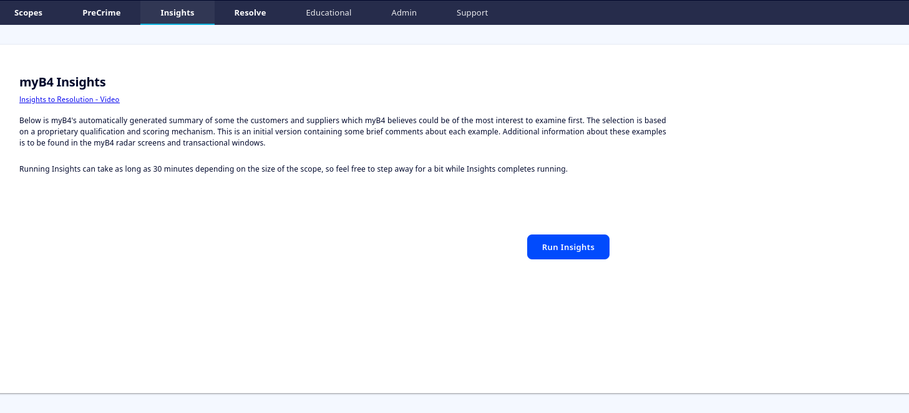
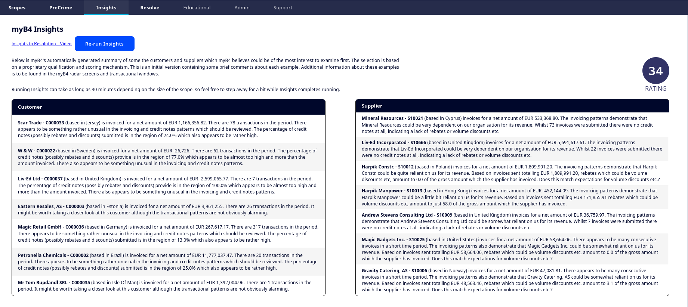

<div style = "index-hero">

# myB4<sup>TM</sup> Insights

**NOTE: This page is being expanded in a future update**

myB4 Insights is a selection algorithm, which can help you identify which examples are most relevant to examine first. it returns the most significant suppliers and/or customers from the active segments in a scope. 

As of current version (v1.6.x), running Insights also generates the overall Scope Rating. This functionality is likely to move in a future update. 

myB4 Insights can be found by navigating from the taskbar to 'Insights' as shown below. 
<p align="center">
        
    </p>
Insights applies to the currently active scope, in the example above: 'yzw_2024_2025'. If you have not run insights on the given scope, you will see a screen like the one below, with a large, blue button prompting you to run Insights. 
<p align="center">
        
    </p>
After Insights have been run, the page will update to reflect the suppliers/customers that are most significant. Each example will have a short description of why it has been selected. 

```admonish tip "Combining Insights and Radar"
While Insights can help you understandd where to begin looking if the Radar is overwhelming, the descriptions provided by Insights can be a bit rudimentary. It is therefore recommended that you locate the examples in the radar, to understand the full extent of signals and warning signs that have been picked up. 
```

Additionally, the page will now show the overall Scope Rating. this should also have been updated in the Scope Dashboard.
<p align="center">
        
    </p>

