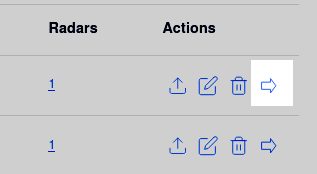
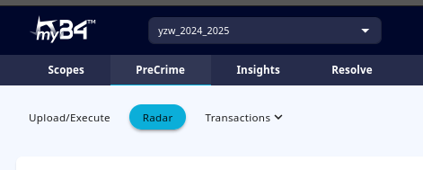
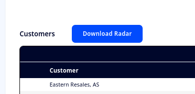
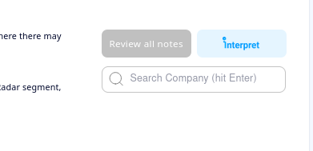
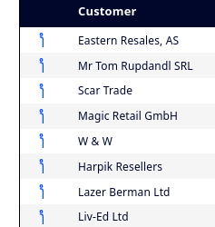
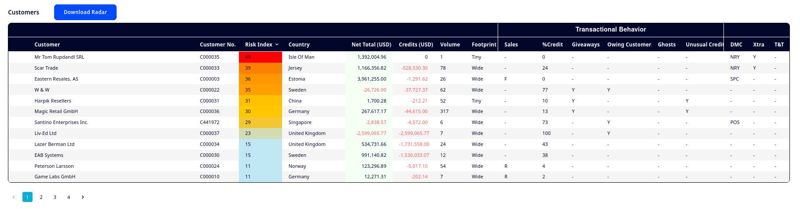

<div style = "index-hero">

# The myB4<sup>TM</sup> Radar
When you have successfully executed the myB4<sup>TM</sup> algorithms, you can access the radar for that scope. You can do so from the Radar Dashboard, by clicking the right hand arrow (go to radar) under 'Actions' for that scope.
<p align="center">
        
    </p>

Alternatively, you can open the PreCrime tab while you have the relevant scope active, then click the Radar tab underneath. 
<p align="center">
        
    </p>

Great! Let's first get an understanding of the various components on this page

## The Radar
Below you can see an example of a Radar page. This one contains all three segments (Customers, Suppliers, and Loose Money), but depending on the data you have uploaded, your radar may contain anywhere from 1-3 segments. 
<p align="center">
        
    </p>
Above each radar, you will see a blue button which reads **'Download Radar'**. If you click it, you will download that particular segment as a .csv-file.
<p align="center">
        
    </p>
    
```admonish tip "Downloading Radars"
While many prefer to do all their work on the platform, the download feature allows you to work with a more flexible format, where you can filter, design and sort according to your needs.
```

### Interpret
In the top right-hand corner, you will see a light blue button which says **'Interpret'**.
<p align="center">
        
    </p>

Clicking this button will run the Interpreter, which creates the automated comments from myB4 Interpret, as well as an Automated Summary for each of the top counterparties. After it has finished running, you will see small, blue 'i's next to the counterparties that have received comments.
<p align="center">
        
    </p>

Clicking one of the counterparties will open the detailed window, were you will see the radar information for the counterparty, followed by the Automated Summary, and then the Interpret comments. You will also see user comments in this window, if any have been made (see: [**Chapter 3.7: The Workflow**](./workflow.md#making-comments)).

## The Searchbar
One more feature to note in the same top righthand corner is Searching. If you input text in the field, the radar(s) will be filtered to only display entities that contain that string. You can read more about searching as part of your analysis in [**Chapter 3.7: The Workflow**](./workflow.md#searching)
<p align="center">
        
    </p>

## Columns in Common
First, let's have a look at the columns the different segments have in common:

### Customer/Supplier/Counterparty
Contains the name of the customer/Supplier/Counterparty as it was in the file uploaded. 
```admonish info "What's in a Name?"
Note that some of our algorithm features will use the name, as is. This means that if the name in your ERP-system contains additional information like a branch name, or C/O etc., that will also be included in the analysis.
```

### Customer/Supplier No. 
This is the unique identifier for each customer/supplier in your ERP-system.

### Risk Index
The Risk Index is a compound score, based on all the transactional flags, along with interaction terms, and materiality weights. The Risk Index runs from 0-100, and higher scores indicate a higher likelihood of fraud or financial damage associated with a counterparty. While this is not a hard rule, a score of 25-39 could be considered interesting, and a score of 40+ is severe. By default, each radar segment is sorted by Risk Index.

### Country
The country where the Customer/Supplier is based (or at least registered in your ERP-system). For the Loose Money segment, this is the *Bank Country* of the sender/receiver.

### Net Total
This is the net total value of transactions with the customer/supplier, expressed in the base accounting currency used in your system (currency code in parentheses). The net total is in other words the value of all invoices minus the value of all credit notes for a customer/supplier. Note that for Loose Money, this is replaced by Total Value, which is the *absolute* value of all transactions - money in plus money out. 

### Credits
This is the total value of credit notes with a customer/supplier.

### Volume 
This is the number of individual transactions with a customer/supplier/counterparty over the period of the data uploaded. 

### Footprint
This is a measure of the online presence of a customer/supplier/counterparty. It is created by getting the number of results obtained when googling the literal name of the company (replaced with Baidu for Chinese entities). 
While the actual algorithm is a bit more sophisticated, you can use this as a rule of thumb:
1. **Tiny** approx. 0-10 results
1. **Low** approx. 10-100 results
1. **Moderate** approx. 100-500 results
1. **Wide** more than 500 results

```admonish tip "Verifying Footprint"
Since the Footprint relies on search engine APIs, there are two pitfalls: Firstly, the API may fail, or get 'booted' by the search engine, in which case it may return artificially small footprints. Secondly, Since it uses the literal string in the 'Name' field, if that does not correspond to the common usage name, results may also be lower than expected. We reccommend that you verify any footprints you find interesting with a manual search.
```

### DMC
Dirty Money Constellations (DMCs) are systems of financial structures, often using secrecy jurisdictions and shell companies, designed to hide the origin of illegally obtained funds (dirty money) while maintaining a connection to the rightful owner. We maintain a ranked list of countries and territories which are frequently used in money laundering, to conceal ownership, and/or to bypass sanctions. The DMC indicator has four levels: 
1. **ABS: Absolute** - These are prime examples of money laundering centres, and dealings with entities based in these countries should be carefully evaluated.
1. **NRY: Nearly** - This category also includes many common dirty money centres/tax havens, and typically, you want to monitor dealings with entities in these locations.
1. **POS: Possibility** - Countries/territories in this category are at risk of being used in sanctions circumvention and/or money laundering, but this will be more situationally dependent. Monitor if a country you do *not* expect to have much dealings with shows up.
1. **SPC: Specific** - This category includes countries that are normally considered fairly safe to have dealings with, but where there are very specific scenarios that may cause concern (for instance countries with porous borders with sanctioned countries). 

We seek to keep our DMC list updated, but administrators can also curate their own DMC lists. You can read more about tailoring your DMC settings in [**Chapter 4.4: Tenant Calibration**](../admin/callibration.md).

### Xtra
The Xtra indicator is a binary indicator which is active if certain trigger-words or phrases are present with a counterparty. This includes names indicative of a risky industry, generic name indicators, names indicating potentially troublesome company structures etc. 

### T&T
Track and Trace is a feature that allows you to add company names (or parts thereof) to an internal register. Whenever the name shows up in a radar, this indicator will be triggered, to indicate that a customer/supplier/counterparty you may have had trouble with in the past, is present in the scope. 

## The Customer Radar
Here, you see an example of a customer radar. Each row represents the analysis of one customer entity, for the period uploaded. Let us go through each column to understand what they contain.
<p align="center">
        
    </p>

### Sales
This is a pattern indicator, which identifies relative patterns associated with possible fraudulent activity. There are three categories, denoted by 'H', 'R', and 'F'. These may appear alone, or in combination. They can be understood as follows: 
- "F" = Large round numbers in invoices, and few or no credit notes. It often indicates customers who are getting "too good a deal". 
- "H" = Lots of small invoices and few credit notes. It often indicates customers who receive discounts that are disproportionate to their size of business. 
- "R" = Large invoices, and lots of small credit notes. It often indicates large customers who get too high a discount.

### %Credit
This indicates the value of credit notes as a percentage of the *total* transaction value. i.e. if it is below 50%, the net total will be positive, if it is 50%, net total is 0, if it is higher than 50%, net total will be negative, and if it is 100%, net total = credits. It can help you identify customers who may be getting too large discounts, who are returning deliveries often, or where abnormally much is going wrong in the delivery process. 

### Giveaways
This is a binary indicator, which is triggered when it looks like a large credit discount is tied to a specific delivery, or if pricings appear significantly lower than comparable customers.

### Owing Customer
A binary indicator which is triggered when net total is negative.

### Ghosts
A binary indicator, which is triggered for customers that have recently (in the scope period) been established, but which have no or few transactions in the period. This can indicate customers set up to boost KPIs for instance.

### Unusual Credit
This indicates situations where there are few credit notes, with high values (relative to the sales values), which could indicate bulk discounts, kickbacks or similar. 


## The Supplier Radar
Here, you see an example of a supplier radar. Each row represents the analysis of one supplier entity, for the period uploaded. Let us go through each column to understand what they contain.
<p align="center">
        
    </p>
    
### Influence
A scale ranging from 0-100. Influence indicates the extent of dependency the supplier has on you, or if the supplier is sending multiple invoices in a short period. This could indicate exposure to leveraging if the supplier is providing a critical resource. 

### Low Rebates
A binary indicator which is triggered if the supplier provides little or nothing back in credit notes. It can indicate a lack of volume discounts, or nothing *ever* going wrong with deliveries (likely?). 

```admonish tip "Low Rebates Relevance"
Note that for many companies, volume discounts, and even corrections are handled without using credit notes, instead being baked into the invoices directly. If this is typical in your organisation, you may want to limit or remove the infuence of this factor by [**Calibrating the Algorithms**](../admin/callibration.md)
```

### %Round
Indicates as a percentage the transactional amounts which are large and round (when correcting for currency value). Could be an indicator of laziness, arbitrary pricing, rounding up or similar. 

### Lump Sum Cred
Percentage indicator which indicates the number of Credit notes which are sent in round amounts, indicating arbitrary or lump sum credits, and sometimes disputes that have been resolved (but is it to your benefit, or that of the supplier?)

### Unusual Invoice Numbers
A percentage indicator, which captures the presence of several unusual invoice patterns. It will be triggered by bunched invoices, invoice numbers that are largely sequential, low invoice numbers (indicating a small company or one which has a unique sequence for you), invoice numbers with no discernible patterns etc. While the interpretation will vary depending on the actual pattern, this indicator tells you you should have a look at the invoice numbers, and try to understand why they present in that way. 

```admonish info "Small Samples"
If the supplier has fewer than 25 invoices in the period, this indicator is capped at 71, to prevent small sample sizes (where unusal patterns may be coincidental) from skewing scores too much.
```

