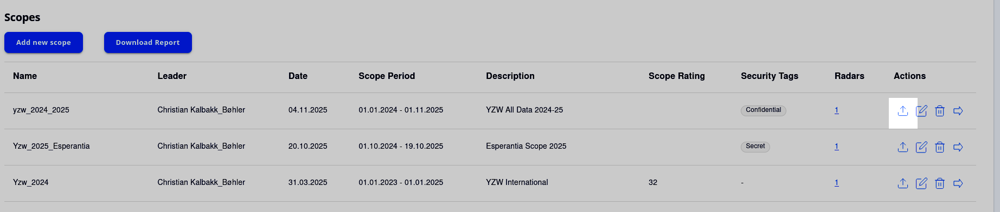
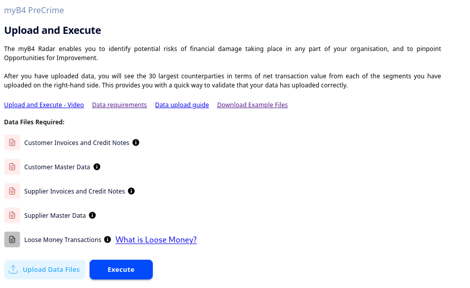
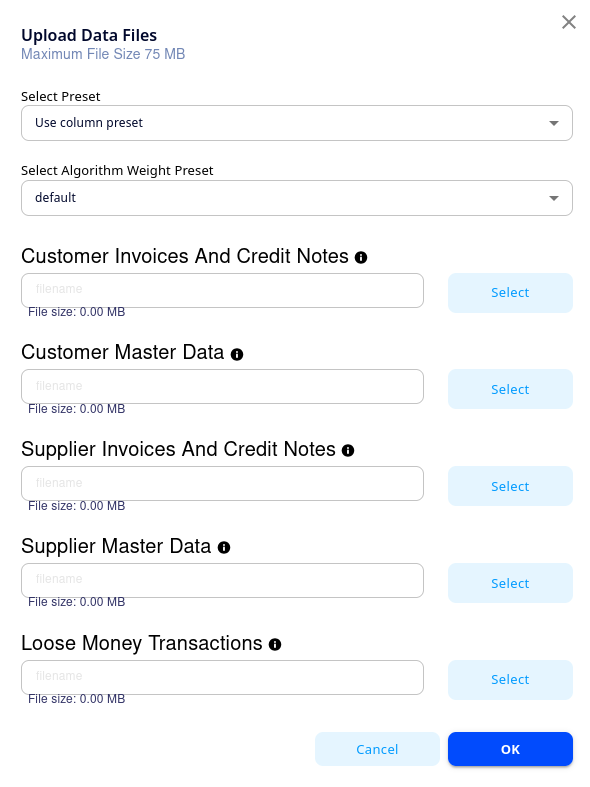
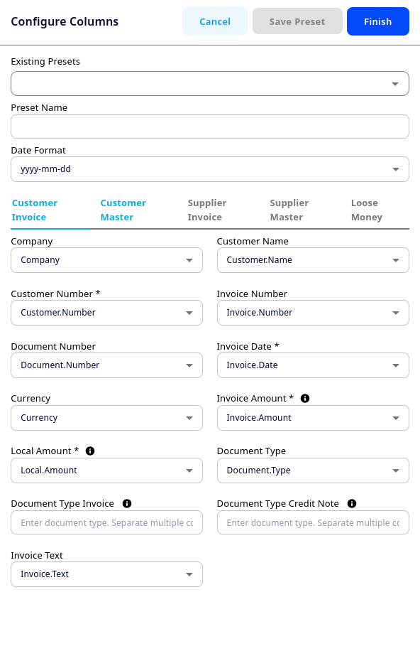
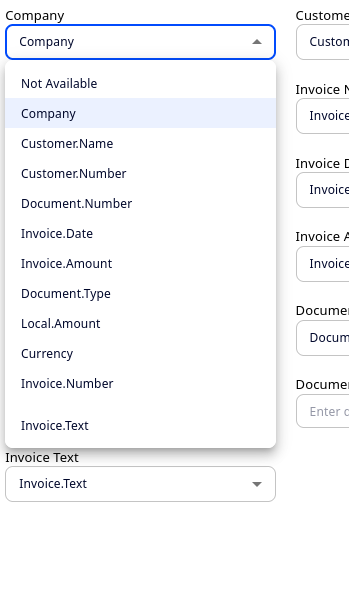
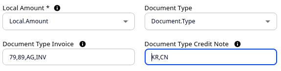
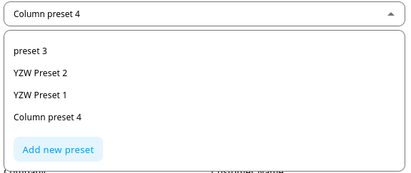
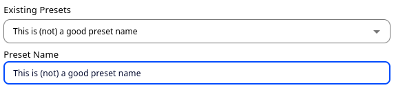
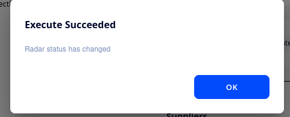

<div style = "index-hero">

# Upload & Execute

Heads up! This chapter will cover a fair bit of information related to the process of uploading data to the platform, and creating the myB4<sup>TM</sup> radar. If you are comfortable with most of the process and just need a speed guide, go to [**Summary**](./upload.md#summary). To make navigation easier, the below are links to the different topics:

1. [**Navigating to Upload**](./upload.md#navigating-to-upload)
1. [**Selecting Data to Upload**](./upload.md#selecting-data)
1. [**Allocating Columns**](./upload.md#allocating-columns)
1. [**Saving a Preset**](./upload.md#saving-presets)
1. [**Using Presets**](./upload.md#using-presets)
1. [**Executing Algorithms**](./upload.md#executing-algorithms)
1. [**Common Problems**](./upload.md#common-problems)
1. [**Summary**](./upload.md#summary)

## Navigating to Upload
Firstly, from the Scope Dashboard screen, navigate to the appropriate scope upload screen, by clicking the upload button under 'Actions' for that scope. 
    <p align="center">
        
    </p>
If you have not created the scope yet, see [**Chapter 3.2: Creating a Scope**](./create-scope.md). 

Alternatively, you can navigate from the toolbar by clicking PreCrime>Upload/Execute. Make sure that you have chosen the appropriate scope from the drop-down menu. 

From this screen, click 'Upload Data Files'.
    <p align="center">
        
    </p>

## Selecting Data
After clicking 'Upload Data Files', you should see the following pop up:
<p align="center">
        
    </p>
Click 'Select' next to each of the files you want to upload. You will then open your file system, where you can navigate to the appropriate files. For more information about files, see [**Chapter 3.3: Data Requirements**](./data-req.md).

```admonish info "File Checker"
The system will check that the files you have chosen for upload comply with .csv-format, and size limits, as well as that you have uploaded both transactional file and master file when uploading customer/supplier data. If any breaches are detected, the field will turn red, otherwise it will turn green.
```

When you have chosen all the files you want to upload and selected the Column Preset (see: [**Using Presets**](./upload.md#using-presets)), click 'OK', and the pop-up window will close.

```admonish tip "Algorithm Weight Preset"
Note that unless your tenant administrator has created new algorithm weights, and instructed you to use them in particular, you should use the 'default' weights. If you are an admin and want to create new weight settings, see: [**Chapter 4.4: Tenant Calibration**](../admin/callibration.md)
```

## Allocating Columns
This part will assume you are not using already defined presets for column allocation. If you are, move ahead to [**Using Presets**](./upload.md#using-presets). 

After you have selected your files and closed the dialogue box, you should see a new button which says 'Configure Columns'
    <p align="center">
        
    </p>
Clicking it will open a new window on the right had side of your screen. Let us go through this from top to bottom:
    <p align="center">
        
    </p>
    
At the very top you will see three buttons: 'Cancel' exits the dialogue box without saving your configuration. 'Save Preset' is used when creating or updating presets, and 'Finish' saves your column specification and closes the dialogue. 

Below that, there are three fields: 'Existing Presets', 'Preset Name', and 'Date Format'. The first two are used when [**Creating a Preset**](./upload.md#saving-presets), so ignore them for now. 'Date Format' allows you to choose the date standard used in your data files (e.g. yyyy-mm-dd or dd/mm/yyyy). 

Below that, you will see separate tabs for all the files you have uploaded, up to five (as in the example image). When you click one, it will turn light blue, and the area below will show all the column options for that file. 

Column allocation must be done for all files you have uploaded. Start by activating one tab. Then, for each field, click the drop down menu to show all the options in your data:
    <p align="center">
        
    </p>
Choose the appropriate column, and repeat this process for all fields before moving to the next tab. For non-essential fields, you can also choose 'not available'. 

```admonish tip "Automatic assignment"
The system will trry to assign columns automatically, based on the field's name in your uploaded data. This functionality only works for English language in the current version of myB4.ai, and you should review the allocation in case something has been mismatched.
```

### Document Type
Document type is only a necessary field if you have unsigned data. If you need to use document type, first assign the right field to Document Type from the dropdown, then in the text input field for invoices and credit notes, list all document types representing invoices and credit notes, respectively.

```admonish warning "Input Format"
When inputting document types in the text fields, note that they are **case sensitive**, and that they should *only* be separated by commas, no spaces or other signs.
```
    <p align="center">
        
    </p>

After you have completed this allocation in all tabs, you can either click 'Finish', and move to [**Executing Algorithms**](./upload.md#executing-algorithms), or save your allocation as a preset (see [**Saving Presets**](./upload.md#saving-presets) below. 

```admonish info "Missing/Wrong Allocation"
If you have neglected to allocate a column, or if you have accidentally assigned the same column to two different fields, the dialogue will not close when you click 'Finish', and the tab(s) where there are errors will turn red. Return to the affected tab(s) to correct the issue, and try clicking 'Finish' again.
```

## Saving Presets
Often, you will find yourself uploading data with a similar format multiple times. To make this process smoother, you may want to save your allocation as a preset, so you do not have to repeat the assignment everytime you upload new data. 

To do so, first do your Column Allocation as described above, but **before** clicking 'Finish', open the dropdown menu under 'Existing Presets', and click 'Add New Preset'. 
    <p align="center">
        
    </p>

Then, under preset name, you can change the name of the preset to a nicely descriptive one. We recommend making you presets easily identifiable, especially if your organisation may end up using multiple different ones. 
    <p align="center">
        
    </p>

Finally, click 'Save Preset' in the top right hand corner, before clicking 'Finish' as per usual. 

## Using Presets
If you have presets saved on your tenant, rather than manually assigning columns during upload, you may apply your saved allocation. There are two ways to do so:

**From the file upload** dialogue box, once you have chosen your files for upload, click the dropdown menu under **Select Preset**, and choose the appropriate preset from there and click 'OK' before proceeding to [**Executing Algorithms**](./upload.md#executing-algorithms)

**From the column allocation** window, open the dropdown under **Existing Presets**, and choose the appropriate preset, then click 'Finish' in the top right hand corner. 
    <p align="center">
        
    </p>

## Executing Algorithms
If you have completed column allocation (manually or with presets), the 'Submit' button should now have turned from grey to blue.
    <p align="center">
        
    </p>
Click submit to run the upload and preprocessing. You should see a green toast message when the files have been uploaded, and another message once preprocessing has finished.

```admonish tip "Stuck in Preprocessing"
Sometimes, the system may appear to remain in preprocessing for a really long time. Usually, this is because the process has gone past an update tick, so that the UI status does not update. If you have received the green toast message to say files have been uploaded, you may try to refresh the page if you have waited for a long time. If it is still processing, you may want to contact support.
```

After preprocessing, you should see a new blue button which says 'Execute', along with a summary of the data you have uploaded on the right hand side. We recommend giving the data a quick review to see that it alligns mostly with what you would expect, before clicking Execute, which runs the myB4<sup>TM</sup> algorithms. After execute has finished, you should see a message saying execute succeeded, and the 'Radar' and 'Transactions' tabs should be active. 
    <p align="center">
        
    </p>
Well done, you have uploaded a scope!

## Common Problems
In general, you will find an error report like the one below whenever you make an upload. This is available both after processing, and after **execute**, and regardless of whether the upload has been successful or not. However, if the upload has failed, this should be the first place to look. 

The errors come in three categories:

1. **Critical** errors, marked with a red warning triangle. 
    ```admonish warning "Critical Errors"
    While there may be other reasons why a scope fails to upload, critical errors are the most common. This category of errors are usually triggered when a necessary column is missing or contains corrupted data. A critical error will *almost* always result in a failure during pre-processing/execute.
    ```

1. **Warning** errors, marked with a yellow warning triangle.
    ```admonish warning "Warning Errors"
    Warning errors are less severe, and will almost never result in an actual failure to process/execute. However, they should not be ignored, as they include information about rows that have been removed as duplicates or corrupted data, as well as other errors that may impact the quality of the radar.
    ```
    
1. **Informative** errors, marked with a grey circle.
    ```admonish info "Informative Errors"
    Informative errors are never going to be the reason while an upload has failed, and almost never has any impact on the quality of the analysis. Instead they may contain information about unimportant columns that have been omitted from upload. This category also contains deprecated errors (i.e. errors that used to be categorised higher, but are now considered unimpactful.
    ```

Beyond the above, another common upload problem is if the user has refreshed the page before the files have been uploaded, which interrupts the process. 
```admonish warning "Refreshing During Upload"
Note that you should never refresh the browser *before* you have received the message "Data has been uploaded". After that message appears, pre-processing begins, and the user is free to refresh, or even close the browser entirely without halting the process.
```

Finally, on occasion, the servers may experience heavy load, particularly if multiple users are uploading especially large data sets at the same time. If your upload takes more than 30-40 minutes, this might be the case. Should you suspect an overload, please reach out to your contact person at B4, who will assist you.


## Summary
This section contains a speed-guide to uploading data:

1. Create a scope, and navigate to the upload page for that scope
1. Click **'Upload'**, and in the window that opens add all the relevant files for upload
    1. If you are using presets, you may also apply that at this stage
    1. Apply the appropriate algorithm weight setting, or leave it as default
    1. Click 'OK'
1. If not using presets (or creating a new one), click **'Configure Columns'**
    1. **Assign the columns** for all files you have uploaded
    1. Create a new preset if you want to save your settings for future use. Make sure to click **'Save Preset'** before continuing
    1. After columns have been assigned (and if relevant, preset saved), click **'Finish'** to close the window
1. Click **'Submit'** to start upload and preprocessing.
    1. You will receive a confirmation once preprocessing has finished.
    1. Sometimes you need to **refresh the page** to sync the UI with the upload.
1. Click **'Execute'** to run the algorithms and create the radar(s).
    1. Once execute finishes, you will receive a confirmation message
    1. The radar tab and transactions tab will now be active.

